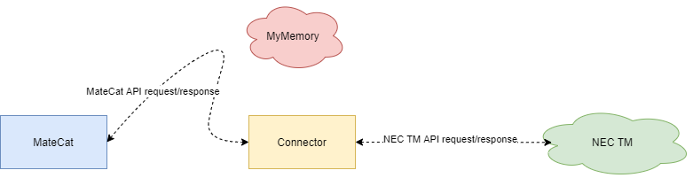

# NEC-TM connector

This connector is to be used as the TM API endpoint for MateCat.

## Requirements

- Docker
- Docker Compose

## Configuration for NEC-TM

The following environment variables can be set for NEC-TM:
- NECTM_URL
- USERNAME
- PASSWORD

If they are not set, default values are used that work in the given docker-compose setup.

## Build and run

### Development

Use the included `docker-compose.yml` file.

### Production

Build and tag the docker image: `docker build -f Dockerfile.prod -t nectm-connector .`.

## API

### Implemented methods
- /get
    - HTTP request method: GET or POST
    - Queries NEC-TM for TM Units
- /update
    - HTTP request method: POST
    - Updates NEC-TM with a TM Unit
- /analyze
    - HTTP request method: POST
    - Analyzes segments from MateCat, returns a word count per segment
    - Does not relay to NEC-TM
